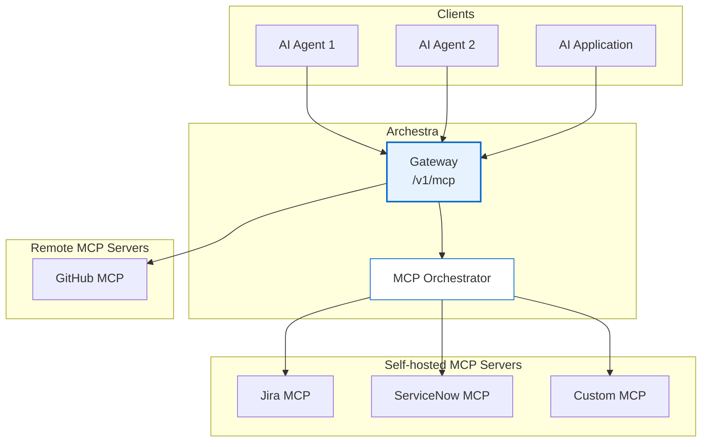

<!-- 
Check ../docs_writer_prompt.md before changing this file.

This document is human-built, shouldn't be updated with AI. Don't change anything here.

Exception:
- Screenshot
-->

MCP Gateway is the unified access point for all MCP servers in Archestra Platform. It provides a single endpoint through which AI agents and applications can discover and interact with multiple MCP servers, regardless of whether they are remote services or locally orchestrated containers.

## To use MCP Gateway:

1. Go to "MCP Registry" and install MCP server.
2. Go to "Profiles" -> Wrench Icon -> Assign tools to the profile.
3. Go to "Profiles" -> Connect Icon -> You'll get connection instructions.

